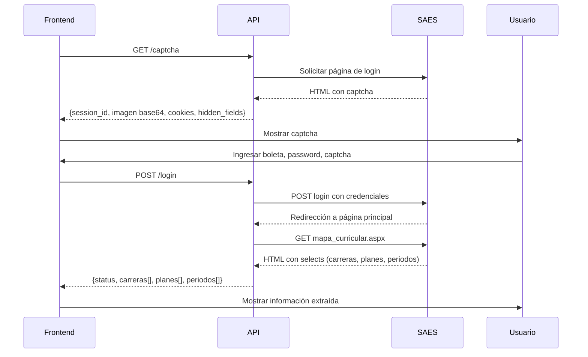

# Implementación del Sistema de Login con Captcha - SAES UPIICSA

## 📋 Resumen de la Implementación

Se ha implementado exitosamente un sistema completo de autenticación con captcha para el SAES de UPIICSA, que incluye:

### ✅ Funcionalidades Implementadas

#### 1. **Extracción de Captcha** (`GET /captcha`)
- Obtiene el captcha desde la página principal del SAES
- Extrae la imagen del captcha codificada en base64
- Captura el HTML completo del div del captcha
- Obtiene los campos ocultos necesarios (`__VIEWSTATE`, `__EVENTVALIDATION`, etc.)
- Captura las cookies de sesión
- Genera un `session_id` único para rastrear la sesión

#### 2. **Refrescar Captcha** (`GET /captcha/refresh`)
- Permite obtener un nuevo captcha si el anterior expiró o no es legible
- Devuelve un nuevo `session_id` con datos actualizados

#### 3. **Verificar Estado** (`GET /captcha/status`)
- Verifica que el servicio del SAES esté disponible
- Útil para diagnóstico y monitoreo

#### 4. **Login y Extracción de Datos** (`POST /login`) 🆕
- Realiza el login al SAES usando:
  - Número de boleta (11 dígitos)
  - Contraseña
  - Código del captcha
  - `session_id` del captcha obtenido previamente
  - Campos ocultos y cookies del captcha
  
- Extrae automáticamente del mapa curricular:
  - **Carreras disponibles**: value y texto (ej: "A" - "ADMINISTRACION INDUSTRIAL")
  - **Planes de estudio**: value y texto (ej: "05" - "Plan del 1/5/1998")
  - **Periodos**: value y texto (ej: "1" - "1")

- Retorna toda la información en formato JSON para uso del frontend

### 📂 Archivos Creados/Modificados

```
schedule-generator-api/
├── routes/
│   └── login.py                      # ✅ Agregado endpoint POST /login
├── schemas/
│   └── captcha.py                    # ✅ Agregados modelos: LoginRequest, LoginResponse, SelectOption, CarreraInfo
├── tests/
│   └── test_login.py                 # ✅ Nuevo archivo con tests del login
├── CAPTCHA_USAGE.md                  # ✅ Actualizado con ejemplos de uso del login
└── README.md                         # Documentación del proyecto
```

### 🔄 Flujo Completo de Uso



### 📊 Estructura de los Datos

#### Request de Login:
```json
{
  "session_id": "dacad968-43b3-4102-a954-b53ec2c9270d",
  "boleta": "20231234567",
  "password": "mi_contraseña",
  "captcha_code": "ABC123",
  "hidden_fields": {
    "__VIEWSTATE": "/wEPDwUKLTY4MDI5...",
    "__EVENTVALIDATION": "/wEWAwKl6s..."
  },
  "cookies": {
    "ASP.NET_SessionId": "2mxkp2..."
  }
}
```

#### Response Exitoso:
```json
{
  "status": "success",
  "message": "Login exitoso y datos del mapa curricular extraídos correctamente",
  "session_id": "dacad968-43b3-4102-a954-b53ec2c9270d",
  "carrera_info": {
    "carreras": [
      {"value": "A", "text": "ADMINISTRACION INDUSTRIAL"},
      {"value": "I", "text": "INGENIERIA INDUSTRIAL"}
    ],
    "planes_estudio": [
      {"value": "05", "text": "Plan del 1/5/1998"},
      {"value": "09", "text": "Plan del 1/8/2009"}
    ],
    "periodos": [
      {"value": "1", "text": "1"},
      {"value": "2", "text": "2"}
    ]
  }
}
```

### 🔐 Seguridad y Buenas Prácticas

1. ✅ **Validación con Pydantic**: Todos los datos de entrada son validados
2. ✅ **Manejo de Errores**: Códigos HTTP apropiados y mensajes descriptivos
3. ✅ **Session Tracking**: Cada sesión tiene un ID único
4. ✅ **Cookie Management**: Mantiene el estado de la sesión con SAES
5. ✅ **Timeout Control**: Timeouts de 15 segundos para evitar bloqueos
6. ✅ **Tests Unitarios**: Cobertura completa de casos de éxito y error

### 🚀 Despliegue

#### Usando Docker Compose:
```bash
# Reconstruir con los cambios
docker-compose down
docker-compose up --build -d

# Verificar que está funcionando
curl http://localhost:3000/captcha/status
```

#### Probar el endpoint:
```bash
# 1. Obtener captcha
curl http://localhost:3000/captcha

# 2. Realizar login (usar datos reales del paso 1)
curl -X POST http://localhost:3000/login \
  -H "Content-Type: application/json" \
  -d '{
    "session_id": "uuid-del-paso-1",
    "boleta": "20231234567",
    "password": "tu_password",
    "captcha_code": "CODIGO_DEL_CAPTCHA",
    "hidden_fields": {...},
    "cookies": {...}
  }'
```

### 📝 Notas Importantes

1. **Session ID**: Debe ser el mismo que se obtuvo en `/captcha`
2. **Cookies y Hidden Fields**: Deben pasarse exactamente como se recibieron
3. **Captcha Expiration**: Si el captcha expira, usar `/captcha/refresh`
4. **Error Handling**: Si el login falla, el API retorna `status: "error"` con el mensaje
5. **Data Consistency**: Los selects se extraen en el orden exacto del HTML del SAES

### 🧪 Testing

```bash
# Ejecutar tests del nuevo endpoint
pytest tests/test_login.py -v

# Ejecutar todos los tests
pytest tests/ -v
```

### 📚 Documentación

- **Swagger UI**: `http://localhost:3000/docs`
- **ReDoc**: `http://localhost:3000/redoc`
- **Ejemplos de uso**: Ver `CAPTCHA_USAGE.md`

---

## 🎯 Próximos Pasos Sugeridos

1. Implementar cache de sesiones para evitar re-login frecuente
2. Agregar rate limiting para prevenir abuso
3. Implementar refresh token para mantener sesiones activas
4. Agregar logging detallado para debugging
5. Implementar webhook para notificar cambios en la disponibilidad del SAES